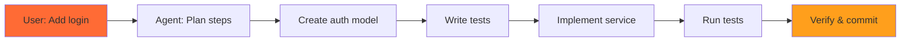

# Agentic Workflows

From AI Autocomplete to Development Partner

  
    Press Space to start <carbon:arrow-right class="inline"/>
  

  <button @click="$slidev.nav.openInEditor()" title="Open in Editor" class="text-xl slidev-icon-btn opacity-50 !border-none !hover:text-white">
    <carbon:edit />
  </button>
  <a href="https://github.com/slidevjs/slidev" target="_blank" alt="GitHub" title="Open in GitHub"
    class="text-xl slidev-icon-btn opacity-50 !border-none !hover:text-white">
    <carbon:logo-github />
  </a>

<!--
Welcome to the Agentic Workflows presentation!

This presentation will take you on a journey from understanding basic LLM capabilities to implementing sophisticated agentic workflows in your development practice.

Target time: 45-60 minutes total
- Introduction and concepts: 8 min
- Benefits and use cases: 7 min
- Live demonstration: 15 min
- Workflow patterns: 10 min
- Practical tips: 8 min
- Q&A: 7 min
-->

---
layout: default
---

# Presentation Overview

<v-clicks>

## What We'll Cover

1. 🤖 **Understanding Agentic Workflows** - What they are and why they matter
2. 💡 **Benefits and Use Cases** - Real-world applications and advantages
3. 🎯 **Live Claude Code Demo** - See agentic workflows in action
4. 🔄 **Workflow Patterns** - Core patterns for practical implementation
5. 🛠️ **Practical Tips** - Getting started and best practices
6. ❓ **Q&A** - Your questions and discussion

</v-clicks>

<!--
This is your roadmap for the next 45-60 minutes.

We'll start with foundational concepts, then see a live demonstration, explore practical patterns, and finish with tips for adoption.

Each section builds on the previous one, so we'll progress from theory to practice.
-->

---
layout: section-header
---

# Section 1: Understanding Agentic Concepts

What are agentic workflows and how do they differ from traditional AI tools?

<!--
Section 1 is your foundation. 

We'll define key terms, establish the mental model shift required, and explore what makes agentic workflows fundamentally different from tools like Copilot or ChatGPT.

Duration: 8 minutes
-->

---
layout: default
---

# What is an LLM?

<v-clicks>

## Large Language Model (LLM)

- **Definition**: AI model trained on vast amounts of text to understand and generate human-like text
- **Core Capability**: Pattern recognition and text completion
- **Interaction Model**: Request → Response (stateless)
- **Limitations**: 
  - No ability to take actions in the real world
  - No memory across conversations (without explicit context)
  - No ability to use tools or access external systems

</v-clicks>

<carbon:information class="inline"/> Think of an LLM as a highly sophisticated autocomplete engine.

<!--
LLMs like GPT-4, Claude, or Llama are powerful text processors.

They excel at understanding context and generating coherent responses, but they're fundamentally reactive and stateless.

Every interaction starts fresh unless you explicitly provide context.

Key limitation: They can suggest code but can't write files, run tests, or execute commands on their own.
-->

---
layout: default
---

# What is an Agent?

<v-clicks>

## AI Agent

- **Definition**: An AI system that can autonomously take actions to achieve goals
- **Core Capability**: Goal-oriented behavior with tool use
- **Interaction Model**: Goal → Plan → Execute → Verify (stateful)
- **Key Characteristics**:
  - **Autonomy**: Can execute multi-step workflows without constant human input
  - **Tool Use**: Can interact with external systems (files, APIs, databases, shell)
  - **Memory**: Maintains context and state across operations
  - **Feedback Loops**: Can observe results and adjust behavior

</v-clicks>

<carbon:bot class="inline"/> Think of an agent as an LLM with hands and memory.

<!--
Agents are LLMs plus agency - the ability to act.

The critical difference: Agents don't just suggest what to do, they actually do it.

They can read files, write code, run tests, search documentation, call APIs, and chain these actions together.

They maintain state across a session, building up context as they work.
-->

---
layout: default
---

# LLM vs Agent: Key Differences

## LLM (Language Model)

<v-clicks>

- 📝 **Reactive**: Responds to prompts
- 🔄 **Stateless**: No memory between requests
- 💬 **Suggests**: Provides recommendations
- 🚫 **Read-only**: Cannot modify systems
- 🎯 **Single-turn**: One question, one answer

</v-clicks>

## Agent (AI Agent)

<v-clicks>

- 🤖 **Proactive**: Executes towards goals
- 🧠 **Stateful**: Maintains context
- ⚡ **Acts**: Executes commands
- ✏️ **Read-write**: Can modify files, run tests
- 🔁 **Multi-turn**: Plans and executes workflows

</v-clicks>

<carbon:arrow-right class="inline"/> <strong>The Shift</strong>: From "AI suggests code" to "AI writes, tests, and deploys code"

<!--
This comparison highlights the fundamental paradigm shift.

LLMs are consultants - they advise but don't execute.
Agents are teammates - they do the work alongside you.

The key enabler: Tool use. Agents can call functions, run shell commands, read/write files, and chain these actions.

Example:
- LLM: "You should add a user model to models/user.py"
- Agent: *Creates models/user.py, writes the code, runs tests, commits changes*
-->

---
layout: default
---

# LLM vs Agent: Interactive Comparison

<LlmAgentComparison />

<carbon:idea class="inline"/> The transformation: From passive advisor to active partner

<!--
This interactive component visualizes the key differences side-by-side.

Notice the pattern:
- LLMs are fundamentally passive - they wait for input and provide output
- Agents are fundamentally active - they pursue goals through action

The bridge between them: Tool use and memory.

When you give an LLM the ability to call functions and maintain state across calls, it becomes an agent.
-->

---
layout: default
---

# Agentic Workflows Defined

<v-clicks>

## What is an Agentic Workflow?

A **structured process** where AI agents autonomously execute multi-step tasks using:

1. 🎯 **Goal Understanding**: Interpret high-level objectives
2. 📋 **Planning**: Break down goals into executable steps
3. 🛠️ **Tool Use**: Interact with files, APIs, databases, shell commands
4. 🔄 **Execution Loops**: Run actions, observe results, adjust approach
5. ✅ **Verification**: Test outcomes and validate success

</v-clicks>

## Real-World Example

<!--
Agentic workflows transform vague requests into concrete implementations.

Key insight: The workflow is a closed loop - the agent observes outcomes and course-corrects.

Traditional development: Human plans → Human codes → Human tests → Human debugs
Agentic workflow: Human sets goal → Agent plans → Agent codes → Agent tests → Agent debugs → Human reviews

The human role shifts from executor to reviewer and decision-maker.

This is not autopilot - it's co-pilot with agency.
-->

---
layout: default
---

# Benefits of Agentic Workflows

<v-clicks>

## Why Adopt Agentic Workflows?

### 🚀 Productivity Gains
- **Faster iteration**: Agent handles boilerplate and repetitive tasks
- **Parallel exploration**: Test multiple approaches simultaneously
- **24/7 execution**: Agents work while you sleep

### 🎯 Quality Improvements
- **Consistency**: Agents follow patterns and conventions reliably
- **Testing**: Automated test generation and execution
- **Documentation**: Code and docs stay synchronized

### 💡 Cognitive Benefits
- **Focus shift**: From typing to reviewing and decision-making
- **Reduced context switching**: Agent maintains project state
- **Learning amplification**: See expert patterns in action

### 🔧 Practical Advantages
- **Onboarding**: New team members productive faster
- **Legacy codebases**: Navigate unfamiliar code with AI guide
- **Cross-domain work**: Get help in unfamiliar tech stacks

</v-clicks>

<!--
The benefits span multiple dimensions - not just speed, but quality and learning too.

Real stat: Developers report 30-55% time savings on routine tasks when using agentic workflows effectively.

Key insight: The biggest benefit isn't speed - it's the elevation of your work. You move from code monkey to architect and reviewer.

Warning: This requires trust-but-verify mindset. Agents are powerful but not infallible.
-->

---
layout: default
---

# Use Cases: Where Agentic Workflows Shine

### 🏗️ **Greenfield Projects**
- Scaffold new projects from specs
- Set up CI/CD pipelines
- Generate boilerplate with tests

### 🔧 **Refactoring**
- Rename variables across codebase
- Extract functions and classes
- Update imports and dependencies

### 🐛 **Debugging**
- Trace errors through stack traces
- Add logging and instrumentation
- Reproduce and fix bugs

### 📚 **Documentation**
- Generate API documentation
- Update README files
- Create usage examples

### ✅ **Testing**
- Write unit and integration tests
- Add test coverage
- Generate test fixtures

### 🔄 **Migrations**
- Update dependencies
- Migrate to new frameworks
- Refactor deprecated APIs

<carbon:idea class="inline"/> <strong>Common pattern</strong>: Tasks that are well-defined but tedious are perfect for agentic workflows

<!--
Agentic workflows excel at tasks with clear success criteria but high execution cost.

Best candidates: Structured, repeatable, verifiable tasks
Poor candidates: Ambiguous requirements, novel algorithms, high-stakes security decisions

The sweet spot: Tasks you understand how to do but don't want to spend time doing manually.

Real example: "Add input validation to all 47 API endpoints" - tedious for humans, perfect for agents.
-->

---
layout: section-header
---

# Section 2: Practical Implementation

How to build and use agentic workflows in real projects

<!--
Section 2 shifts from theory to practice.

We'll explore the toolkit - patterns, frameworks, and techniques for implementing agentic workflows.

This section covers 18 patterns total: 10 foundational workflow patterns + 8 modern agent architectures.

Duration: 25-30 minutes
-->

---
layout: default
---

# Getting Started with Agentic Workflows

<v-clicks>

## Prerequisites

### Development Environment
- Modern IDE (VS Code, Cursor, or similar)
- Git for version control
- Package manager (npm, pip, cargo, etc.)

### AI Development Tools
- **Claude Code** (Primary recommendation) - Anthropic's agentic CLI
- Alternatives: GitHub Copilot, Cursor AI, or other AI-assisted tools
- API access to LLM providers (Anthropic, OpenAI, etc.)

### Conceptual Prerequisites
- Familiarity with command line / terminal
- Basic understanding of AI/LLM capabilities
- Comfort with iterative development

</v-clicks>

<carbon:checkmark class="inline"/> You don't need to be an AI expert - these tools are designed for working developers

<!--
The barrier to entry is lower than you might think.

If you can use Git and run terminal commands, you can start with agentic workflows today.

Claude Code is the recommended starting point - it's specifically designed for software development workflows and has excellent integration with existing tools.

No PhD required - the AI handles the complexity, you guide the direction.
-->

---
layout: default
---

# Pattern Categories Overview

### 🎯 Core Patterns
Fundamental building blocks

- **Reflection** - Self-review and improvement
- **Tool Use** - External system integration
- **Planning** - Task decomposition

### 🔄 Workflow Patterns
Execution control flow

- **Sequential** - Step-by-step execution
- **Parallel** - Concurrent task handling

### 🤝 Coordination Patterns
Multi-agent collaboration

- **Multi-Agent** - Collaborative execution
- **Hierarchical** - Parent-child relationships
- **Routing** - Specialized task delegation

### 🎛️ Control Patterns
Oversight and feedback

- **Human-in-the-Loop** - Human oversight
- **Feedback Loop** - Iterative refinement

<carbon:idea class="inline"/> <strong>Plus 8 Modern Architectures</strong> from the 2025 Architectural Guide

<!--
These 10 foundational patterns can be combined and composed to build sophisticated agentic workflows.

Think of them as LEGO blocks - each pattern solves a specific problem, and you combine them to build complete systems.

We'll also explore 8 cutting-edge architectural patterns from 2025's definitive guide, showing the latest advances in agent systems.

Pattern selection depends on your specific use case - we'll cover selection criteria at the end.

The beauty: Start simple (single pattern) and grow complexity only as needed.
-->

---
layout: section-header
---

# Core Patterns

Fundamental building blocks for agentic workflows

<!--
Core patterns are the foundation - every agentic system uses at least one of these.

Three essential patterns:
1. Reflection - Self-improvement through critique
2. Tool Use - Interaction with external systems
3. Planning - Task decomposition and strategy

These are universally applicable and form the basis for more complex patterns.

Duration: 8-10 minutes for all three
-->

---
layout: default
---

# Reflection Pattern: Self-Improvement

## How It Works

<v-clicks>

1. **Generate**: Agent produces initial output
2. **Critique**: Agent reviews its own work
3. **Refine**: Agent improves based on critique
4. **Repeat**: Iterate until quality threshold met

</v-clicks>

<carbon:idea class="inline"/> The agent becomes its own code reviewer

## Use Cases

- Code quality improvement
- Documentation refinement
- Test case generation
- Error message clarity
- Architecture review

## Benefits

- ✅ Higher quality outputs
- ✅ Reduced human review time
- ✅ Consistent standards
- ✅ Self-correcting behavior

<!--
Reflection is like having the AI be its own pair programmer.

It writes code, then reviews it with fresh eyes (fresh tokens?), identifies issues, and fixes them.

The magic: Each critique-refine cycle improves quality without human intervention.

Real example: "Write a user authentication function" → Agent writes code → Agent reviews for security issues → Agent fixes vulnerabilities → Final code is production-ready.

Limitation: Not good for novel problems where the agent doesn't know what "good" looks like.
-->

---
layout: default
---

# Tool Use Pattern: System Integration

## How It Works

<v-clicks>

1. **Define Tools**: Register available functions/APIs
2. **Plan**: Agent determines which tools to use
3. **Execute**: Agent calls tools with parameters
4. **Observe**: Agent reads tool results
5. **Act**: Agent adjusts based on outcomes

</v-clicks>

<carbon:tools class="inline"/> Transforms suggestions into actions

## Common Tools

- File system (read/write/delete)
- Shell commands
- APIs (REST, GraphQL)
- Databases (SQL, NoSQL)
- Version control (git)
- Package managers (npm, pip)

## Benefits

- ⚡ Autonomous execution
- 🔧 Real-world impact
- 🔄 Feedback loops enabled
- 🎯 Goal-oriented behavior

<!--
Tool use is what makes an agent actually DO things instead of just suggesting things.

Think of tools as the agent's hands - ways to manipulate the world.

The pattern: Agent decides "I need to check if this file exists" → Calls file.exists(path) → Gets true/false → Makes next decision based on result.

This is the CORE difference between LLM and Agent - the ability to take action.

Security note: Tool access must be carefully controlled - agents should only have tools appropriate for their task.
-->

---
layout: default
---

# Planning Pattern: Task Decomposition

## How It Works

<v-clicks>

1. **Understand Goal**: Parse high-level objective
2. **Decompose**: Break into sub-tasks
3. **Order**: Determine dependencies
4. **Execute**: Run tasks in sequence/parallel
5. **Verify**: Check overall goal achieved

</v-clicks>

<carbon:diagram class="inline"/> From "what" to "how" automatically

## Example Decomposition

**Goal**: "Add user authentication"

**Plan**:
1. Create user model
2. Implement password hashing
3. Build login endpoint
4. Add JWT generation
5. Create middleware
6. Write tests

## Benefits

- 📋 Structured approach
- 🎯 Clear progress tracking
- 🔄 Handles complexity
- ✅ Verifiable completion

<!--
Planning is where the agent thinks before acting.

Instead of rushing straight to code, the agent creates a roadmap.

The beauty: Complex requests become manageable sequences of simple tasks.

Real workflow:
User: "Build a REST API for todo items"
Agent Plan:
  1. Define data model (Task, User)
  2. Create database schema
  3. Implement CRUD operations
  4. Add validation
  5. Write API routes
  6. Add authentication
  7. Write tests
  8. Document endpoints

Each step is concrete and testable.

Limitation: Requires the agent to have domain knowledge to create good plans.
-->

---

# Placeholder slides for remaining content

More content will be added for:
- Workflow Patterns (Sequential, Parallel)
- Coordination Patterns (Multi-Agent, Hierarchical, Routing)
- Control Patterns (Human-in-Loop, Feedback)
- Modern Agent Architectures (8 patterns from 2025 guide)
- Live Demonstrations
- Practical Tips
- Q&A

<!--
This is a work in progress. Additional slides will be added as implementation continues.
-->
